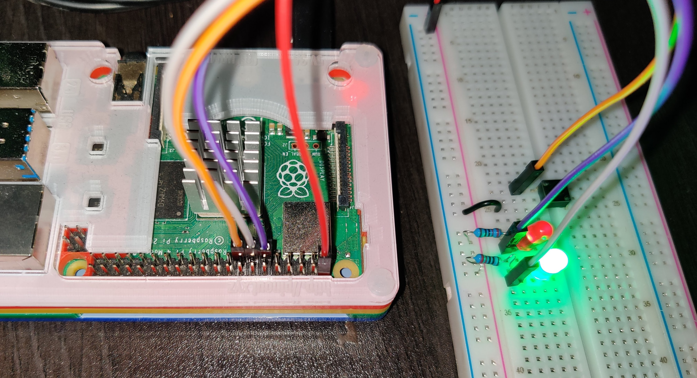

# blurb-the-absurd (@absurdblurb)
####A raspberry pi (rpi) project to record and tweet 10 second spoken blurbs.
####Tools used
- Raspberry Pi (rpi) capable of running python3 and connecting to wifi.
- PC to control rpi
- 3d printer for case
- 1 button, 
- 2 x led lights
- 2 x 300Ω resistors
- 4 x wires
- USB Microphone
- Battery back to power rpi

### Project Road map
1. Setup raspberry pi to be available on the network
2. Creating and configuring new <username> for code execution 
2. Deploying code to rpi
3. Create developer accounts with:
   - [Google Cloud Platform (GCP)](https://cloud.google.com/) for transcribing recorded audio to text 
   - [Twitter](https://developer.twitter.com) for tweeting the transcribed text
4. Storing GCP and Twitter credentials on rpi
5. Configure rpi to run script on startup
6. Add hardware button to rpi to trigger recording
7. Print case for rpi, microphone, button and leds

### Improvements for V2
- Add speakers for simple auditory feedback
- Store all tweet recordings and text in s3 or firebase
### Getting Started

---
**NOTE**  
Pay attention to the context for commands to be run: on your PC or on your rpi (via an ssh session).
---
#### Assumptions
- A familiarity with git, creating/deleting branches, committing to a branch, pushing to a remote branches etc.  
- A vague familiarity with networking (ipv4, ipv6, ip address, mac address)  
- A vague familiarity with SSH and public/private keys  

#### Setting up Raspberry Pi 
####On your PC:
- Make a [bootable sd card](https://www.raspberrypi.org/documentation/installation/installing-images/) for the raspberry pi (rpi) 
- Update sd card to [connect to your network](https://howchoo.com/g/ndy1zte2yjn/how-to-set-up-wifi-on-your-raspberry-pi-without-ethernet)
- Update sd card to [enable SSHing](https://phoenixnap.com/kb/enable-ssh-raspberry-pi) on the rpi  
- Find rpi's IP address. If you're PC is linux, try using arp-scan to find the device on the network:  
`sudo apt-get install arp-scan`  
`sudo arp-scan --localnet`  
- Find the rpi's IP in the list, [export that IP address as an environment variable](https://linuxize.com/post/how-to-set-and-list-environment-variables-in-linux/) on your (hopefully linux based) PC, eg:  
`export RPI_IP=192.168.X.X`  
- Either connect the rpi to a monitor and control it as a computer, or begin an SSH session with the pi.  
- Remembering that default Rasbian OS has a root user of ['pi' and a password of 'raspberry'](https://pimylifeup.com/default-raspbian-username-and-password/)  
- To ssh into  your rpi from your PC for the first time run:
    - `ssh pi@$RPI_IP`
    
###Having successfully SSHed from your PC to  your rpi
####From your rpi:
- [Change the password for the default 'pi' user](https://www.raspberrypi.org/forums/viewtopic.php?t=193620)
- [Create a new user](https://raspberrytips.com/new-user-on-raspberry-pi/) on the pi to use going forward:
    - `sudo adduser <username> sudo # Creates a user and enables them to perform sudo actions  # don't forget your password`
    - `sudo usermod -aG sound,gpio <username>  # to give <username> permissions to 1) record and play audio with audio devices attached to the pi and 2) Control GPIO pins`
- Confirm <username> was added to 'audio' and 'gpio' groups:
    - `groups <username>`
- Change users from pi to your new <username>:
    - `su - <username>`
- Ensure you're logged in as <username>:
    - `whoami`
- Install necessary tools/libraries, eg:
    - `sudo apt update`
    - `sudo apt-get install python3`
    - `sudo apt-get install portaudio19-dev  # for recording functionality` 
    - `sudo apt-get install python-rpi.gpio  # for controlling the GPIO pins`
 ---
**NOTE**  
The rest of this flow assumes all actions on the rpi are performed as `<username>`
---

####On your PC
- export your newly created <username> as an environment variable `RPI_USER`, eg update `~/.bashrc` with: 
    - `export RPI_USER=<username>`
- [Create an alias](https://www.tecmint.com/create-alias-in-linux/) to facilitate sshing into the pi from your PC's terminal:
    - `alias ssh_rpi='ssh "$RPI_USER"@"$RPI_IP"'`
---
**NOTE**  
- Your rpi could be assigned a different IP address by the router if it reconnects to the network (or for other reasons). So you might need to update this $RPI_IP environment variable in the future.
- Don't forget to [`source`](https://www.routerhosting.com/knowledge-base/what-is-linux-bashrc-and-how-to-use-it-full-guide/) your `~/.bashrc` or `~/.zshrc` files after modifying
---

- Confirm all the appropriate environment variables and aliases have been set on your PC:
    - `echo $RPI_IP`
    - `echo $RPI_USER`
    - `which ssh_rpi`

###If you don't like having to enter a password every time you ssh to the rpi, you can authenticate using [ssh keys](https://electrobotify.wordpress.com/2019/08/14/passwordless-ssh-into-raspberry-pi-with-openssh/).
#### On your PC
- Generate an SSH key ([if it doesn't exist](https://www.techrepublic.com/article/how-to-view-your-ssh-keys-in-linux-macos-and-windows/)). The public key portion of this PC's SSH key needs to be copied to the rpi to enable sshing (from PC to rpi) without manually entering a password every time.
- If no key exists on PC, run: 
    - `ssh-keygen -t rsa`

- Copy your PC's *public* key to your rpi's list of known hosts, from your PC run:
`ssh-copy-id $RPI_USER@$RPI_IP`

- Verify the ssh key is copied by sshing into the rpi and verify no password is requested:  
    - `ssh_rpi`
    
###Creating GCP account to use '[Speed-to-Text API](https://cloud.google.com/speech-to-text/)' for transcription
To transcribe audio you will need a Google Cloud Platform (GCP) account to transcribe audio recorded by your rpi. 
- Create a [GCP Account](https://support.google.com/a/answer/7389973?hl=en&ref_topic=7386475)
- Retrieve your GCP account's, [private json key](https://cloud.google.com/speech-to-text/docs/quickstart-protocol?hl=en_US).
- Once you've downloaded the generated key to you PC, copy it to your rpi as your rpi will be making the requests to GCP for transcription:
    - `rsync -auzr /path/to/downloaded/json/key $RPI_USER@$RPI_IP:~/google-cloud-api-key.json`

###Creating Twitter Account to use [Twitter API](https://developer.twitter.com/en/docs/twitter-api/v1/tweets/post-and-engage/overview)
- Create a Twitter account and visit [twitter's developer portal](https://developer.twitter.com/en)
- Create a new [Twitter project](https://developer.twitter.com/en/docs/projects/overview)
- Generate a read & write [Access Token and Access Token Secret](https://www.slickremix.com/docs/how-to-get-api-keys-and-tokens-for-twitter/) for this project
- Save the new Twitter project's secrets somewhere safe (NOT in your code) :
    - API Key
    - API Secret Key
    - Access Token 
    - Access Secret    

###Add GCP and Twitter Credentials to rpi
####On the rpi:
- [Export environment variables](https://linuxize.com/post/how-to-set-and-list-environment-variables-in-linux/) for these GCP and Twitter secrets
    - `export GOOGLE_APPLICATION_CREDENTIALS=/home/<username>/google-cloud-api-key.json`
    - `export TWITTER_API_KEY=1mtaXXXXXXXXXXXXXXXXx1dQL`
    - `export TWITTER_API_SECRET=31K4KXXXXXXXXXXXXXXXXXXXXXXXXXXXXXXXXXvPG`
    - `export TWITTER_ACCESS_TOKEN=10000000000000000-zXXXXXXXXXXXXXXXXXXXXXXy`
    - `export TWITTER_ACCESS_TOKEN_SECRET=VfwXXXXXXXXXXXXXXXXXXXXXXXPoR`

###Forking and Cloning this code
####On your PC:
- [Fork this repo](https://docs.github.com/en/github/getting-started-with-github/fork-a-repo) to have your own copy of the code 
- Clone your forked repo to your PC, eg:
    - `cd ~`
    - `git clone git@github.com:<your-github-account>/blurb-the-absurd.git`
- Run the `./deploy.sh` script (from this repo) to copy the python code to the rpi's home directory of <username>:  
    - If it's  your first time 'deploying' the code the the rpi, use: `./deploy.sh -f` flag for a *fresh* deploy (ie running `pip install`)

---
**NOTE**  
To stop all running processes of the python script on the rpi (instead of deploying and running the script), on your PC, run:
    - `./deploy.sh -s`
---

## Setting up Pi to auto run script on boot-up
Having now configured the rpi with the necessary GCP and Twitter credentials, as well as deploying the code the rpi, now we want to have the script run on the rpi [whenever the rpi boots up](https://www.wikihow.com/Execute-a-Script-at-Startup-on-the-Raspberry-Pi ).
- On the rpi, create an `~/.envSecrets` file to hold your Twitter secrets:
```
TWITTER_API_KEY=1mtaXXXXXXXXXXXXXXXXx1dQL
TWITTER_API_SECRET=31K4KXXXXXXXXXXXXXXXXXXXXXXXXXXXXXXXXXvPG
TWITTER_ACCESS_TOKEN=10000000000000000-zXXXXXXXXXXXXXXXXXXXXXXy
TWITTER_ACCESS_TOKEN_SECRET=VfwXXXXXXXXXXXXXXXXXXXXXXXPoR
```

###Create a systemd service to run the python script on rpi boot-up:
####On the rpi:
- Create a new service file in systemd `/etc/systemd/system/blurb-the-absurd.service`
With these contents:
```
[Unit]
Description=Blurb the Absurd Service
After=network-online.target

[Service]
Type=simple
EnvironmentFile=/home/<username>/.envSecrets
ExecStart=/bin/bash /home/<username>/blurb-the-absurd/run.sh
StandardOutput=inherit
StandardError=inherit
Restart=on-failure
RestartSec=5
User=<username>

[Install]
WantedBy=multi-user.target
```

- Start this service to verify it runs the python code
    - `sudo systemctl start blurb-the-absurd.service`
    - `sudo systemctl status blurb-the-absurd.service`

# Wiring the button and LEDs
The code expects the following pin numbers on a Raspberry Pi v4, you might need to change them in the code:
- red led pin = 11
- green led pin = 13
- button pin = 15


*Picture of wiring on Rapsberry Pi v4*


*Diagram of pinout, LEDs, and button*

